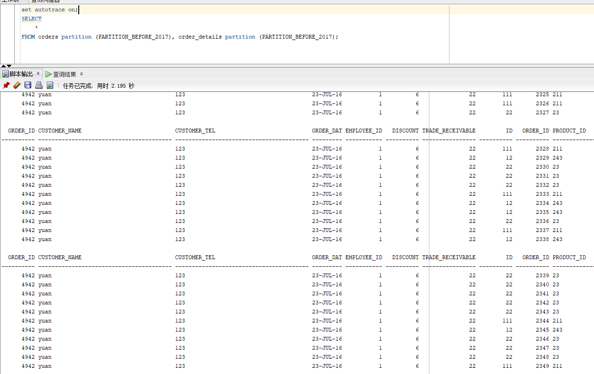
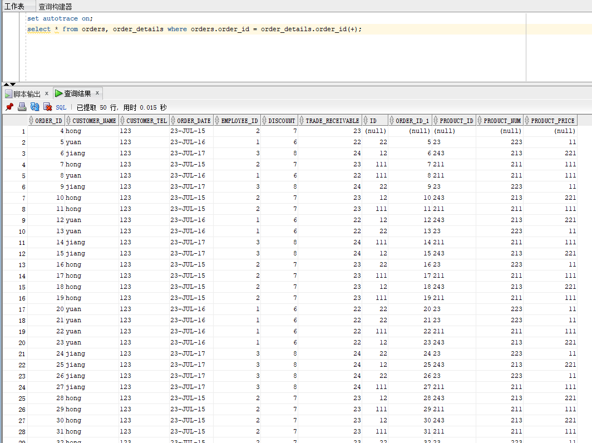

# 实验3：创建分区表

## 实验目的：

掌握分区表的创建方法，掌握各种分区方式的使用场景。

## 实验内容：
- 本实验使用3个表空间：USERS,USERS02,USERS03。在表空间中创建两张表：订单表(orders)与订单详表(order_details)。
- 使用**你自己的账号创建本实验的表**，表创建在上述3个分区，自定义分区策略。
- 你需要使用system用户给你自己的账号分配上述分区的使用权限。你需要使用system用户给你的用户分配可以查询执行计划的权限。
- 表创建成功后，插入数据，数据能并平均分布到各个分区。每个表的数据都应该大于1万行，对表进行联合查询。
- 写出插入数据的语句和查询数据的语句，并分析语句的执行计划。
- 进行分区与不分区的对比实验。

## 实验参考步骤

【示例8-11】在主表orders和从表order_details之间建立引用分区
在study用户中创建两个表：orders（订单表）和order_details（订单详表），两个表通过列order_id建立主外键关联。orders表按范围分区进行存储，order_details使用引用分区进行存储。
##第一步创建orders表的部分语句是：
```sql 
CREATE TABLE ORDERS
(
order_id NUMBER(10,0)NOT NULL,
customer_name VARCHAR2(40 BYTE)NOT NULL,
customer_tel VARCHAR2(40 BYTE)NOT NULL,
order_date DATE NOT NULL,
employee_id NUMBER(6,0) NOT NULL,
discount NUMBER(8,2)DEFAULT 0,
trade_receivable NUMBER(8,2)DEFAULT 0
)
TABLESPACE USERS
PCTFREE 10
INITRANS 1
STORAGE
(
BUFFER_POOL DEFAULT
)
PARTITION BY RANGE (order_date)  //RANGE分区类型
(
PARTITION partition_before_2016 VALUES LESS THAN (
TO_DATE(' 2016-01-01 00: 00: 00', 'SYYYY-MM-DD HH24: MI: SS',
'NLS_CALENDAR=GREGORIAN'))TABLESPACE USERS,
PARTITION partition_before_2017 VALUES LESS THAN (
TO_DATE(' 2017-01-01 00: 00: 00', 'SYYYY-MM-DD HH24: MI: SS',
'NLS_CALENDAR=GREGORIAN'))TABLESPACE USERS02,
PARTITION partition_before_2018 VALUES LESS THAN (
TO_DATE(' 2018-01-01 00: 00: 00', 'SYYYY-MM-DD HH24: MI: SS',
'NLS_CALENDAR=GREGORIAN'))TABLESPACE USERS02
);
```

##第二步创建order_details表的语句如下：
```sql
CREATE TABLE order_details
(
id NUMBER(10,0)NOT NULL,
order_id NUMBER(10,0)NOT NULL,
product_id VARCHAR2(40 BYTE)NOT NULL,
product_num NUMBER(8,2) NOT NULL,
product_price NUMBER(8,2) NOT NULL,
CONSTRAINT order_details_fk1 FOREIGN KEY (order_id)
REFERENCES orders ( order_id )
ENABLE
)
TABLESPACE USERS
PCTFREE 10 
INITRANS 1
STORAGE( BUFFER_POOL DEFAULT )
NOCOMPRESS NOPARALLEL
PARTITION BY REFERENCE (order_details_fk1);
```

##第三步向orders表中插入数据的语句如下：
```sql
INSERT INTO orders(customer_name, customer_tel, order_date, employee_id, trade_receivable, discount) VALUES('WANG', '152', to_date ( '2016-12-20 18:31:34' , 'YYYY-MM-DD HH24:MI:SS' ), 001, 16, 6);
```
##orders表部分数据内容：


##第四步向order_details表中插入数据的语句如下：
```sql
insert into order_details(id, PRODUCT_ID, PRODUCT_NUM, PRODUCT_PRICE) VALUES(233, 233, 233, 255.66);
insert into order_details(id, PRODUCT_ID, PRODUCT_NUM, PRODUCT_PRICE) VALUES(332, 332, 332, 266.55);
insert into order_details(id, PRODUCT_ID, PRODUCT_NUM, PRODUCT_PRICE) VALUES(323, 323, 323, 265.56);
```
##order_details表部分数据内容：


##第五步分区查询代码和结果：
```sql
set autotrace on;
SELECT
    *
FROM orders partition (PARTITION_BEFORE_2017), order_details partition (PARTITION_BEFORE_2017);
```

##第六步不分区查询代码及结果：
```sql
set autotrace on;
select * from orders, order_details where orders.order_id = order_details.order_id(+);
```

##解释计划：


#分析：
