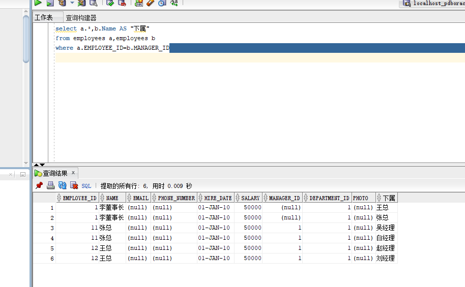
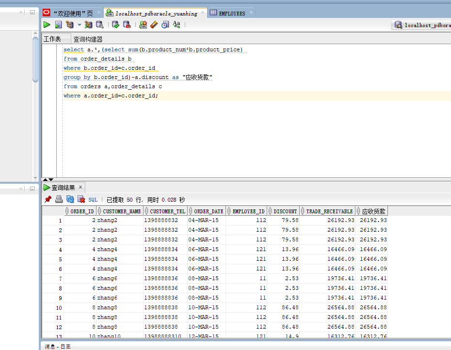
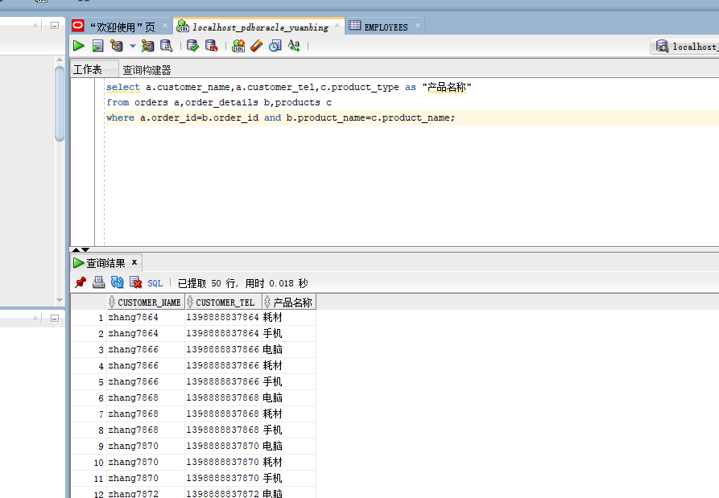
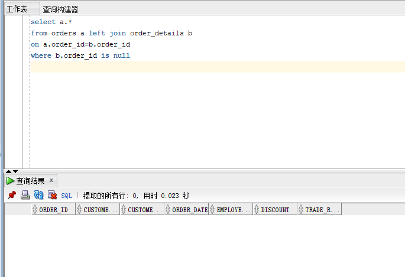
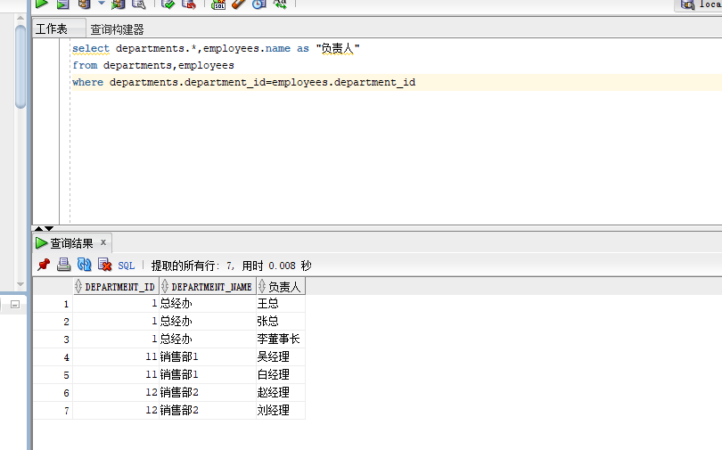
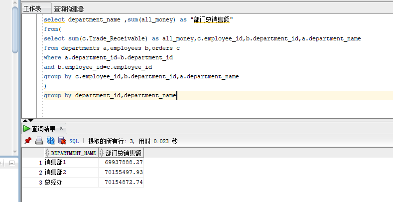

# 实验4：对象管理
# 用户名：yuanbing
## 实验目的：
了解Oracle表和视图的概念，学习使用SQL语句Create Table创建表，学习Select语句插入，修改，删除以及查询数据，学习使用SQL语句创建视图，学习部分存储过程和触发器的使用。
## - 实验场景：
假设有一个生产某个产品的单位，单位接受网上订单进行产品的销售。通过实验模拟这个单位的部分信息：员工表，部门表，订单表，订单详单表。

## 实验内容：
### 录入数据：
要求至少有1万个订单，每个订单至少有4个详单。至少有两个部门，每个部门至少有1个员工，其中只有一个人没有领导，一个领导至少有一个下属，并且它的下属是另一个人的领导（比如A领导B，B领导C）。

###  序列的应用
插入ORDERS和ORDER_DETAILS 两个表的数据时，主键ORDERS.ORDER_ID, ORDER_DETAILS.ID的值必须通过序列SEQ_ORDER_ID和SEQ_ORDER_ID取得，不能手工输入一个数字。

###  触发器的应用：
维护ORDER_DETAILS的数据时（insert,delete,update）要同步更新ORDERS表订单应收货款ORDERS.Trade_Receivable的值。
## 设计分析

## 表的创建

## 数据分区

##  查询数据：
   1.查询某个员工的信息
### 代码：
```sql 
select * from employees where employee_id=11;
```


   2.递归查询某个员工及其所有下属，子下属员工。
### 代码：
```sql 
select a.*,b.Name AS "下属"
from employees a,employees b
where a.EMPLOYEE_ID=b.MANAGER_ID 
```


   3.查询订单表，并且包括订单的订单应收货款: Trade_Receivable= sum(订单详单表.ProductNum*订单详单表.ProductPrice)- Discount。

### 代码：
```sql
select a.*,(select sum(b.product_num*b.product_price)
from order_details b
where b.order_id=c.order_id
group by b.order_id)-a.discount as "应收货款"
from orders a,order_details c
where a.order_id=c.order_id;
```


   4.查询订单详表，要求显示订单的客户名称和客户电话，产品类型用汉字描述。

### 代码：
```sql
select a.customer_name,a.customer_tel,c.product_type as "产品名称"
from orders a,order_details b,products c
where a.order_id=b.order_id and b.product_name=c.product_name;
```


   5.查询出所有空订单，即没有订单详单的订单。
### 代码：
```sql
select orders.*
from orders a left join order_details b
on a.order_id=b.order_id
where b.order_id is null
```


   6.查询部门表，同时显示部门的负责人姓名。

### 代码：
```sql
select departments.*,employees.name as "负责人"
from departments,employees
where departments.department_id=employees.department_id
```

   7.查询部门表，统计每个部门的销售总金额。
### 代码：
```sql
select department_name ,sum(all_money) as "部门总销售额"
from(
select sum(c.Trade_Receivable) as all_money,c.employee_id,b.department_id,a.department_name
from departments a,employees b,orders c 
where a.department_id=b.department_id
and b.employee_id=c.employee_id
group by c.employee_id,b.department_id,a.department_name
)
group by department_id,department_name
```



